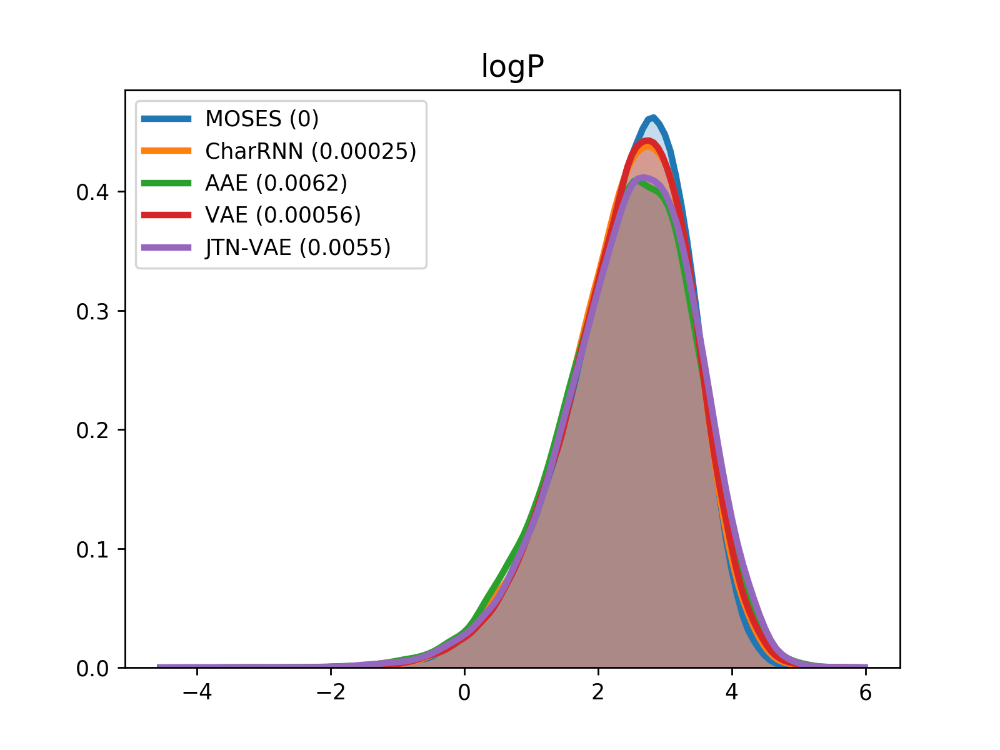
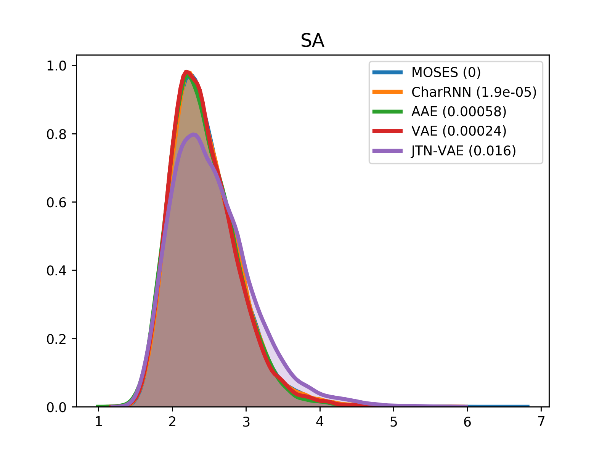
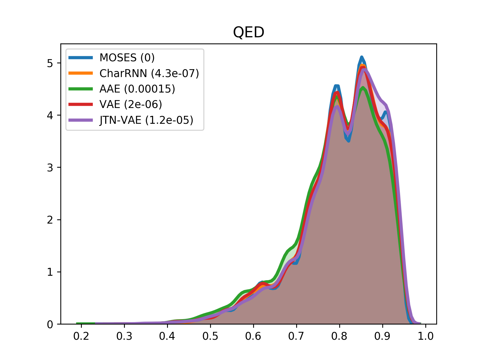
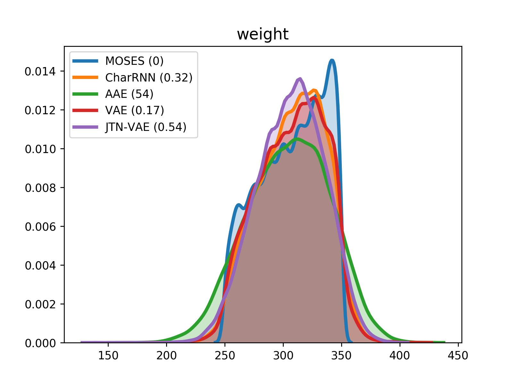

# Molecular Sets (MOSES): A benchmarking platform for molecular generation models

[](https://travis-ci.com/molecularsets/moses)

Deep generative models such as generative adversarial networks, variational autoencoders, and autoregressive models are rapidly growing in popularity for the discovery of new molecules and materials. In this work, we introduce MOlecular SEtS (MOSES), a benchmarking platform to support research on machine learning for drug discovery. MOSES implements several popular molecular generation models and includes a set of metrics that evaluate the diversity and quality of generated molecules. MOSES is meant to standardize the research on molecular generation and facilitate the sharing and comparison of new models. Additionally, we provide a large-scale comparison of existing state of the art models and elaborate on current challenges for generative models that might prove fertile ground for new research. Our platform and source code are freely available here.

__For more details, please refer to the [paper](https://arxiv.org/abs/1811.12823).__


## Dataset

We propose [a benchmarking dataset](https://media.githubusercontent.com/media/molecularsets/moses/master/data/dataset_v1.csv) refined from the ZINC database.

The set is based on the ZINC Clean Leads collection. It contains 4,591,276 molecules in total, filtered by molecular weight in the range from 250 to 350 Daltons, a number of rotatable bonds not greater than 7, and XlogP less than or equal to 3.5. We removed molecules containing charged atoms or atoms besides C, N, S, O, F, Cl, Br, H or cycles longer than 8 atoms. The molecules were filtered via medicinal chemistry filters (MCFs) and PAINS filters.

The dataset contains 1,936,962 molecular structures. For experiments, we also provide a training, test and scaffold test sets containing 250k, 10k, and 10k molecules respectively. The scaffold test set contains unique Bemis-Murcko scaffolds that were not present in the training and test sets. We use this set to assess how well the model can generate previously unobserved scaffolds.

## Models

* [Character-level Recurrent Neural Network (CharRNN)](./moses/char_rnn/README.md)
* [Variational Autoencoder (VAE)](./moses/vae/README.md)
* [Adversarial Autoencoder (AAE)](./moses/aae/README.md)
* [Objective-Reinforced Generative Adversarial Network (ORGAN)](./moses/organ/README.md)
* [Junction Tree Variational Autoencoder (JTN-VAE)](https://github.com/wengong-jin/icml18-jtnn/tree/master/fast_molvae)


## Metrics
Besides standard uniqueness and validity metrics, MOSES provides other metrics to access the overall quality of generated molecules. Fragment similarity (Frag) and Scaffold similarity (Scaff) are cosine distances between vectors of fragment or scaffold frequencies correspondingly of the generated and test sets. Nearest neighbor similarity (SNN) is the average similarity of generated molecules to the nearest molecule from the test set. Internal diversity (IntDiv) is an average pairwise similarity of generated molecules. Fréchet ChemNet Distance (FCD) measures the difference in distributions of last layer activations of ChemNet.

<table border="1" class="dataframe">
    <thead>
        <tr style="text-align: right;">
            <th rowspan="2">Model</th>
            <th rowspan="2">Valid (↑)</th>
            <th rowspan="2">Unique@1k (↑)</th>
            <th rowspan="2">Unique@10k (↑)</th>
            <th colspan="2">FCD (↓)</th>
            <th colspan="2">SNN (↑)</th>
            <th colspan="2">Frag (↑)</th>
            <th colspan="2">Scaff (↑)</th>
            <th rowspan="2">IntDiv (↑)</th>
            <th rowspan="2">IntDiv2 (↑)</th>
            <th rowspan="2">Filters (↑)</th>
        </tr>
        <tr>
            <th>Test</th>
            <th>TestSF</th>
            <th>Test</th>
            <th>TestSF</th>
            <th>Test</th>
            <th>TestSF</th>
            <th>Test</th>
            <th>TestSF</th>
        </tr>
    </thead>
    <tbody>
        <tr>
            <th><i>Train</i></th>
            <td><i>1.0000</i></td>
            <td><i>1.0000</i></td>
            <td><i>1.0000</i></td>
            <td><i>0.1320</i></td>
            <td><i>0.5994</i></td>
            <td><i>0.4833</i></td>
            <td><i>0.4635</i></td>
            <td><i>0.9997</i></td>
            <td><i>0.9981</i></td>
            <td><i>0.8756</i></td>
            <td><i>0.0000</i></td>
            <td><i>0.8567</i></td>
            <td><i>0.8508</i></td>
            <td><i>1.0000</i></td>
        </tr>
        <tr>
            <th>CharRNN</th>
            <td>0.9959</td>
            <td><b>1.0000</b></td>
            <td>0.9961</td>
            <td><b>0.1806</b></td>
            <td><b>0.6428</b></td>
            <td><b>0.4809</b></td>
            <td><b>0.4634</b></td>
            <td><b>0.9994</b></td>
            <td><b>0.9979</b></td>
            <td>0.8291</td>
            <td>0.0632</td>
            <td>0.8568</td>
            <td>0.8508</td>
            <td><b>0.9988</b></td>
        </tr>
        <tr>
            <th>VAE</th>
            <td>0.9556</td>
            <td><b>1.0000</b></td>
            <td>0.9885</td>
            <td>0.2115</td>
            <td>0.6837</td>
            <td>0.4782</td>
            <td>0.4610</td>
            <td><b>0.9994</b></td>
            <td>0.9974</td>
            <td><b>0.8356</b></td>
            <td>0.0405</td>
            <td>0.8549</td>
            <td>0.8490</td>
            <td>0.9968</td>
        </tr>
        <tr>
            <th>AAE</th>
            <td>0.9318</td>
            <td><b>1.0000</b></td>
            <td><b>0.9997</b></td>
            <td>0.6645</td>
            <td>1.2380</td>
            <td>0.4267</td>
            <td>0.4178</td>
            <td>0.9916</td>
            <td>0.9898</td>
            <td>0.7192</td>
            <td><b>0.1363</b></td>
            <td><b>0.8604</b></td>
            <td><b>0.8549</b></td>
            <td>0.9857</td>
        </tr>
        <tr>
            <th>ORGAN</th>
            <td>0.8731</td>
            <td>0.9910</td>
            <td>0.9260</td>
            <td>1.5721</td>
            <td>2.4292</td>
            <td>0.4745</td>
            <td>0.4593</td>
            <td>0.9897</td>
            <td>0.9883</td>
            <td>0.7843</td>
            <td>0.0632</td>
            <td>0.8526</td>
            <td>0.8457</td>
            <td>0.9934</td>
        </tr>
        <tr>
            <th>JTN-VAE</th>
            <td><b>1.0000</b></td>
            <td><b>1.0000</b></td>
            <td>0.9992</td>
            <td>0.5370</td>
            <td>1.1328</td>
            <td>0.4441</td>
            <td>0.4345</td>
            <td>0.9960</td>
            <td>0.9948</td>
            <td>0.7908</td>
            <td>0.0978</td>
            <td>0.8512</td>
            <td>0.8453</td>
            <td>0.9778</td>
        </tr>
    </tbody>
</table>

For comparison of molecular properties, we computed the Frèchet distance between distributions of molecules in the generated and test sets. Below, we provide plots for lipophilicity (logP), Synthetic Accessibility (SA), Quantitative Estimation of Drug-likeness (QED), Natural Product-likeness (NP) and molecular weight.

|logP|SA|
|----|--|
|||
|NP|QED|
|||
|weight|
||

# Installation

### Docker

1. Install [docker](https://docs.docker.com/install/) and [nvidia-docker](https://github.com/nvidia/nvidia-docker/wiki/Installation-(version-2.0)).

2. Pull an existing image (4.1Gb to download) from DockerHub:

```bash
docker pull molecularsets/moses
```

or clone the repository and build it manually:

```bash
git clone https://github.com/molecularsets/moses.git
nvidia-docker image build --tag molecularsets/moses moses/
```

3. Create a container:
```bash
nvidia-docker run -it --name moses --network="host" --shm-size 10G molecularsets/moses
```

4. The dataset and source code are available inside the docker container at /moses:
```bash
docker exec -it molecularsets/moses bash
```

### Manually
Alternatively, install dependencies and MOSES manually.

1. Clone the repository:
```bash
git lfs install
git clone https://github.com/molecularsets/moses.git
```

2. [Install RDKit](https://www.rdkit.org/docs/Install.html) for metrics calculation.

3. Install MOSES:
```bash
python setup.py install
```


# Benchmarking your models

* Install MOSES as described in the previous section.

* Split the dataset (automatically done with `run.py`):
```bash
python scripts/split_dataset.py --dir data/
```
This will create `train.csv`, `test.csv`, `test_scaffolds.csv`, on which you should train and test your models. It will also create some `.npz` files for faster calculation of metrics. <b>Note that the training set size is 250k molecules, and test sets are 10k molecules each.</b>

* Calculate metrics for the trained model:

```bash
python scripts/eval.py --ref_path <reference dataset> --gen_path <generated dataset>
```

* Add both generated samples and metrics to your repository

# Platform usage

### Training

```bash
python scripts/train.py <model name> \
       --train_load <train dataset> \
       --model_save <path to model> \
       --config_save <path to config> \
       --vocab_save <path to vocabulary>
```

To get a list of supported models run `python scripts/train.py --help`.

For more details of certain model run `python scripts/train.py <model name> --help`.

### Generation

```bash
python scripts/sample.py <model name> \
       --model_load <path to model> \
       --vocab_load <path to vocabulary> \
       --config_load <path to config> \
       --n_samples <number of samples> \
       --gen_save <path to generated dataset>
```

To get a list of supported models run `python scripts/sample.py --help`.

For more details of certain model run `python scripts/sample.py <model name> --help`.

### Evaluation

```bash
python scripts/eval.py \
       --ref_path <reference dataset> \
       --gen_path <generated dataset>
```

For more details run `python scripts/eval.py --help`.


### End-to-End launch

You can run pretty much everything with:
```bash
python scripts/run.py
```
This will **split** the dataset, **train** the models, **generate** new molecules, and **calculate** the metrics. Evaluation results will be saved in `metrics.csv`.

You can specify the GPU device index as `cuda:n` (or `cpu` for CPU) and/or model by running:
```bash
python scripts/run.py --device cuda:1 --model aae
```

For more details run `python scripts/run.py --help`.
